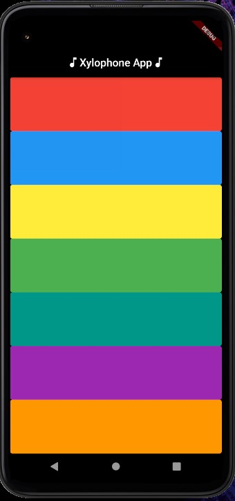

# Xylo

A simple Xylophone App made with the [Flutter Framework](https://flutter.dev/), see how many songs you can make!

## Contents

1. [Running in Android Studio Emulator](#running-in-android-studio-emulator)
1. [Screenshots](#screenshots)
1. [Contributors](#contributors)

### Running in Android Studio Emulator

* Clone this Project Directory **OR** Download Project .zip [here](https://github.com/AlexDuthie/xylophone-app/archive/refs/heads/main.zip)
* Open Cloned Project in Android Studio
* Run [lib/main.dart](lib/main.dart) in a specified emulator

> Flutter is quite a reactive framework so most of the changes you make will be 'painted' onto the emulator screen simultaneously, this is called 'Hot Reload'.

### Screenshots

### Contributors

* Alex Duthie - [Linkedin](https://www.linkedin.com/in/alexduthielnkdn/) - [GitHub](https://www.github.com/AlexDuthie)